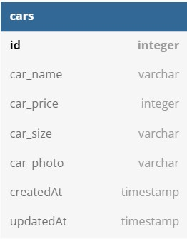
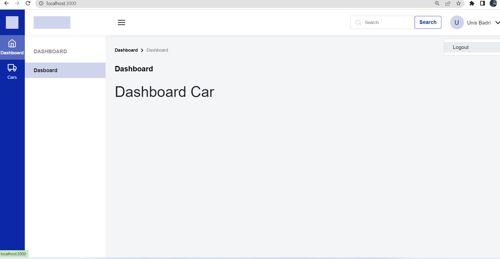
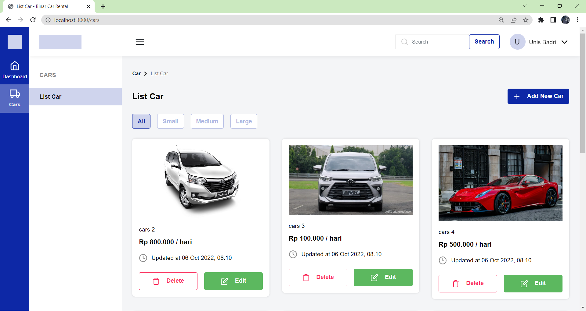
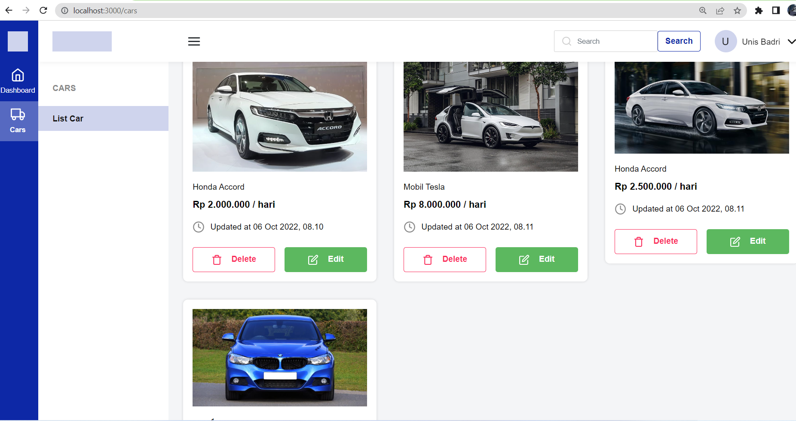
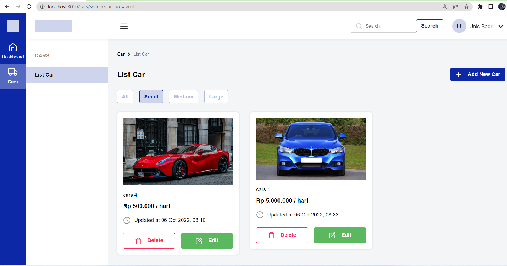
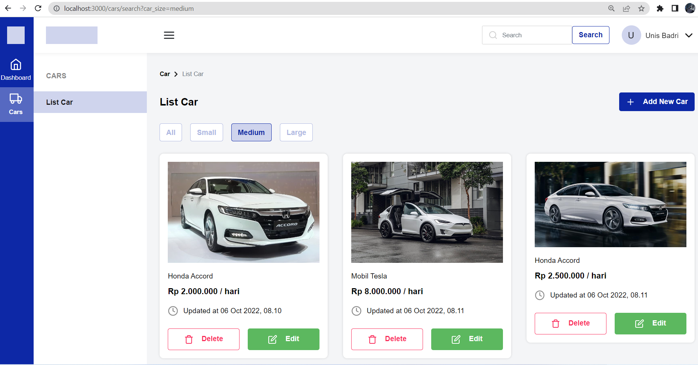
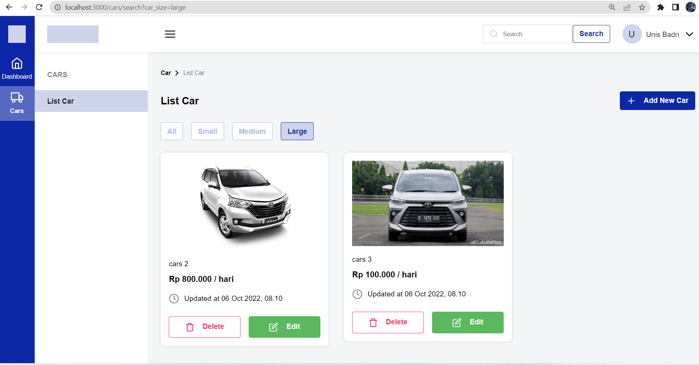
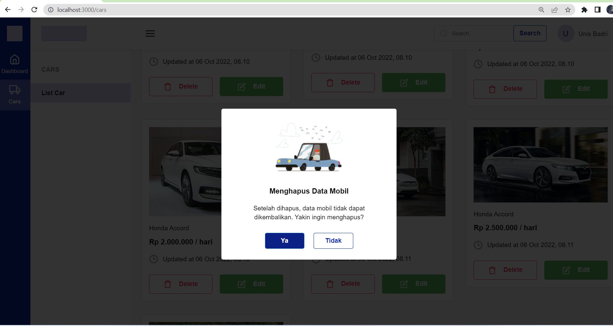

<div id="top"></div>

<br />


  <h3 align="center">CH5 Binar Car management dashboard</h3>

  <p align="center">Car Management Dashboard</p>
</div>

<!-- Tentang Ch 5 ini -->

## The Project

- DB Diagram
  <br>
  

- Halaman Dashboard
  <br>
  

- Halaman Cars
  <br>
  
  

- Halaman Filter Cars Size
  <br>
  
  
  

- Halaman Add Car
  <br>
  

- Halaman Edit Car
  <br>
  

- Halaman Delete Car
  <br>
  

### dibuat menggunakan:

- ExpressJS
- Bootstrap
- Sequelize
- Postgres

<p align="right">(<a href="#top">back to top</a>)</p>


### Cara instalasi ke repo lokal

1. Clone dari repo saya
   ```
   git clone https://github.com/JINAN27/Car-Management-Dashboard.git
   ```
2. Install paket yang di perlukan
   ```
   npm install 
   untuk mengambil module dari projek ini ketikkan di terminal
   npm install --save form-data
   ```
3. selanjutnya atur seperti dibawah 

   ```
   - setting config.json
   - sequelize db:create
   - sequelize db:migrate
   - sequelize db:seed:all
   ```

4. lalu run dengan cara:
   ```
   npm start
   ```

<p align="right">(<a href="#top">back to top</a>)</p>

## Info

- Get all cars : GET <code>/cars</code>
- Create a car : POST <code>/cars/create</code>
- Update a car : PUT <code>/cars/update/:id</code>
- Delete a car : DELETE <code>/cars/delete/:id</code>

- Filter size car : GET <code>/cars/search/?car_size=</code>
- Search cars by name and size : GET <code>/cars/search/?q=</code>

<p align="right">(<a href="#top">back to top</a>)</p>

## License

Distributed under the MIT License. See `LICENSE.txt` for more information.
